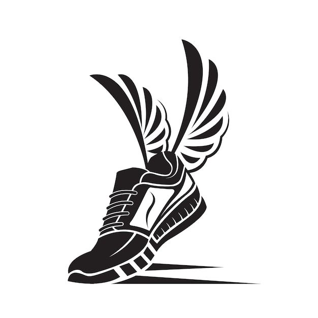

<a name="readme-top">

<br/>

<br />
<div align="center">
  <a href="https://github.com/lagamiaSam/">
    
  </a>
  <h3 align="center">SneakHub</h3>
</div>
<div align="center">
  SneakHub is your ultimate destination for premium basketball sneakers. Discover top brands like Nike, Adidas, and Jordan — all curated for style and performance. Step into the game with confidence and elevate your sneaker game at SneakHub.
</div>

<br />


[](https://wakatime.com/badge/user/fd3ba1ac-97d0-47fc-a9f6-66db8812adb9/project/8e968a8b-5199-4dad-8864-c7038608d743)

---

<br />
<br />

<!-- TODO: If you want to add more layers for your readme -->
<details>
  <summary>Table of Contents</summary>
  <ol>
    <li>
      <a href="#overview">Overview</a>
      <ol>
        <li>
          <a href="#key-components">Key Components</a>
        </li>
        <li>
          <a href="#technology">Technology</a>
        </li>
      </ol>
    </li>
    <li>
      <a href="#rule,-practices-and-principles">Rules, Practices and Principles</a>
    </li>
    <li>
      <a href="#resources">Resources</a>
    </li>
  </ol>
</details>

---

## Overview

<!-- TODO: To be changed -->
<!-- The following are just sample -->

Description of the project in details.

### Key Components

<!-- TODO: List of Key Components -->
<!-- The following are just sample -->

- Authentication & Authorization
- CRUD Operations for Invetory System

### Technology

<!-- TODO: List of Technology Used -->
#### Language


#### Framework/Library


## Rules, Practices and Principles

<!-- Do not Change this -->

1. Always use `AD-` in the front of the Title of the Project for the Subject followed by your custom naming.
2. Do not rename `.php` files if they are pages; always use `index.php` as the filename.
3. Add `.component` to the `.php` files if they are components code; example: `footer.component.php`.
4. Add `.util` to the `.php` files if they are utility codes; example: `account.util.php`.
5. Place Files in their respective folders.
6. Different file naming Cases
   | Naming Case | Type of code         | Example                           |
   | ----------- | -------------------- | --------------------------------- |
   | Pascal      | Utility              | Accoun.util.php                   |
   | Camel       | Components and Pages | index.php or footer.component.php |
8. Renaming of Pages folder names are a must, and relates to what it is doing or data it holding.
9. Use proper label in your github commits: `feat`, `fix`, `refactor` and `docs`
10. File Structure to follow below.

```
AD-ProjectName
└─ assets
|   └─ css
|   |   └─ name.css
|   └─ img
|   |   └─ name.jpeg/.jpg/.webp/.png
|   └─ js
|       └─ name.js
└─ components
|   └─ name.component.php
|   └─ templates
|      └─ name.component.php
└─ handlers
|   └─ name.handler.php
└─ pages
|  └─ pageName
|     └─ assets
|     |  └─ css
|     |  |  └─ name.css
|     |  └─ img
|     |  |  └─ name.jpeg/.jpg/.webp/.png
|     |  └─ js
|     |     └─ name.js
|     └─ index.php
└─ utils
|   └─ name.utils.php
└─ vendor
└─ .gitignore
└─ bootstrap.php
└─ composer.json
└─ composer.lock
└─ index.php
└─ readme.md
└─ router.php
```
> The following should be renamed: name.css, name.js, name.jpeg/.jpg/.webp/.png, name.component.php(but not the part of the `component.php`), Name.utils.php(but not the part of the `utils.php`)

## Resources

<!-- TODO: Add References -->

| Title        | Purpose                                                                       | Link          |
| ------------ | ----------------------------------------------------------------------------- | ------------- |
| Freepik |To help designers, developers, students, and content creators by offering ready-to-use visual assets that they can use in projects | https://www.freepik.com/ |
| Chat GPT | The purpose is to guide small details in programming and etc	 | https://chatgpt.com/ |
| w3school | The purpose is to demonstrate the fundamental concepts of programming declarations, conditional statements, and loops | https://www.w3schools.com/ |
| Pinterest | The purpose is to present stylish sneaker-themed web visuals and design inspiration, while practicing responsive layout | https://ph.pinterest.com/ |
| Google | The purpose is to search some related stuff about programming, pictures for assets and etc. | https://www.google.com/ |
